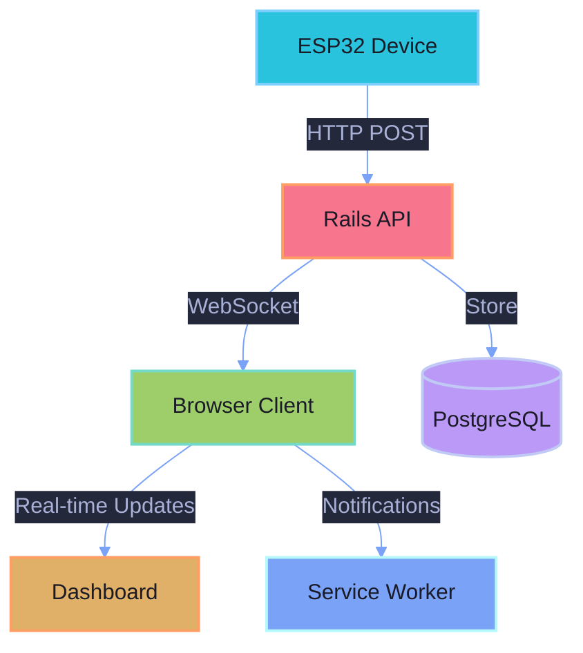

# 🌱 Sprout Server

<div align="center">


[](https://rubyonrails.org/)
[](https://www.ruby-lang.org/)
[](https://www.postgresql.org/)
[](https://hotwired.dev/)
[](https://tailwindcss.com/)

[](https://github.com/mathisto/sprout-server/actions)
[](LICENSE)
[](https://github.com/mathisto/sprout-server/commits/trunk)

*A modern, real-time plant monitoring system powered by ESP32 devices and Rails* 🪴

[Features](#-features) • [Getting Started](#-getting-started) • [Development](#-development) • [Deployment](#-deployment) • [Contributing](#-contributing)

</div>

## ✨ Features

- 🌿 Real-time plant moisture monitoring
- 📊 Beautiful, interactive charts and visualizations
- 🔔 Instant notifications when plants need attention
- 📱 Progressive Web App (PWA) support
- 🤖 ESP32 device integration
- 🔄 WebSocket-powered live updates
- 🎨 Modern, responsive UI with TailwindCSS
- 🧪 Comprehensive test suite

## 🚀 Getting Started

### Prerequisites

- Ruby 3.3.0
- PostgreSQL 14+
- Node.js 18+
- Yarn 1.x
- Redis (optional, for ActionCable in production)

### Quick Start

1. Clone the repository:
```bash
git clone https://github.com/mathisto/sprout-server.git
cd sprout-server
```

2. Install dependencies:
```bash
bundle install
yarn install
```

3. Set up your environment:
```bash
cp .env.example .env
# Edit .env with your configuration
```

4. Set up the database:
```bash
rails db:create db:migrate db:seed
```

5. Start the development server:
```bash
bin/dev
```

Visit http://localhost:3000 and start monitoring your plants! 🌱

## 💻 Development

### Running Tests

```bash
bundle exec rspec                 # Run all tests
bundle exec rspec spec/models     # Run specific test directory
bundle exec rspec spec/models/plant_spec.rb  # Run specific test file
```

### Code Quality

```bash
bundle exec rubocop              # Ruby style guide
bundle exec brakeman            # Security vulnerabilities
bundle exec bundle audit        # Gem vulnerabilities
```

### Architecture



## 📦 Deployment

This application uses [Kamal](https://kamal-deploy.org/) for deployment:

1. Set up your deployment configuration:
```bash
cp config/deploy.yml.example config/deploy.yml
# Edit deploy.yml with your server configuration
```

2. Deploy:
```bash
bin/kamal setup
bin/kamal deploy
```

## 🤝 Contributing

We love contributions! Please check out our [Contributing Guide](CONTRIBUTING.md) for guidelines.

1. Fork the repository
2. Create your feature branch (`git checkout -b feature/amazing-feature`)
3. Commit your changes (`git commit -am 'Add some amazing feature'`)
4. Push to the branch (`git push origin feature/amazing-feature`)
5. Open a Pull Request

## 📝 License

This project is licensed under the MIT License - see the [LICENSE](LICENSE) file for details.

## 🙏 Acknowledgments

- [Ruby on Rails](https://rubyonrails.org/) - The web framework that powers everything
- [Hotwire](https://hotwired.dev/) - For making real-time updates a breeze
- [TailwindCSS](https://tailwindcss.com/) - For the beautiful UI components
- [Chart.js](https://www.chartjs.org/) - For the gorgeous data visualizations
- All our [contributors](https://github.com/mathisto/sprout-server/graphs/contributors) 💚

---

<div align="center">

Made with 💚 by [Matt Kelly](https://github.com/mathisto)

<sub>Theme inspired by [Tokyo Night](https://github.com/enkia/tokyo-night-vscode-theme) 🌃</sub>

</div>
